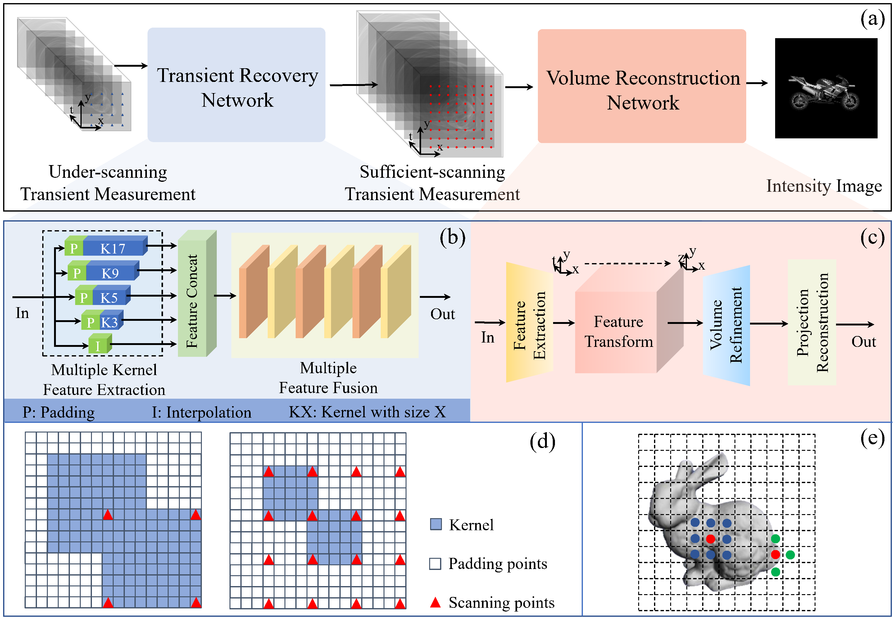

# Under-scanning_NLOS
Deep Non-line-of-sight Imaging from Under-scanning Measurements (NeurIPS 2023)

### Pipeline

### Reconstructed Results from Real-world Measurements Captured by [FK](https://github.com/computational-imaging/nlos-fk).

### Reconstructed Results from Real-world Measurements Captured by [NLOST](https://github.com/Depth2World/NLOST).

### Trade-off about the Sampling Points and Noise Levels

### Datasets
**Synthetic Data**\
We utilized the synthetic data (~3000 motorbike dataset) provided by [LFE](https://github.com/princeton-computational-imaging/NLOSFeatureEmbeddings). \
You can download [Here](https://drive.google.com/file/d/183VAD_wuVtwkyvfaBoguUHZgHu065BNW/view)

**Real-world Data**\
We utilized the real-world data provided by [FK](https://github.com/computational-imaging/nlos-fk) and [NLOST](https://github.com/Depth2World/NLOST).\
Or you can download the preprocessed data [Here]().

### Experiment
We first train the network on **Synthetic Data**, and then directly test on **Real-world Data**.
#### Training
Modify the data path and then run `bash train.sh`

#### Testing
1, [Synthetic] Modify the data path and then run `python validate_syn.py`\
2, [Real-world] Modify the data path and then run `python validate_fk.py` and `python validate_cvpr2023.py`

### Contact 
For questions, feel free to contact us (yueli65@mail.ustc.edu.cn).

### Acknowledgements
We thank the authors who shared the code of their works. Particularly [LFE](https://github.com/princeton-computational-imaging/NLOSFeatureEmbeddings).
### Citation
If you find it useful, please cite our paper.

    @inproceedings{li2023deep,
    title={Deep Non-line-of-sight Imaging from Under-scanning Measurements},
    author={Li, Yue and Zhang, Yueyi and Ye, Juntian and Xu, Feihu and Xiong, Zhiwei},
    booktitle={Thirty-seventh Conference on Neural Information Processing Systems},
    year={2023}
    }

